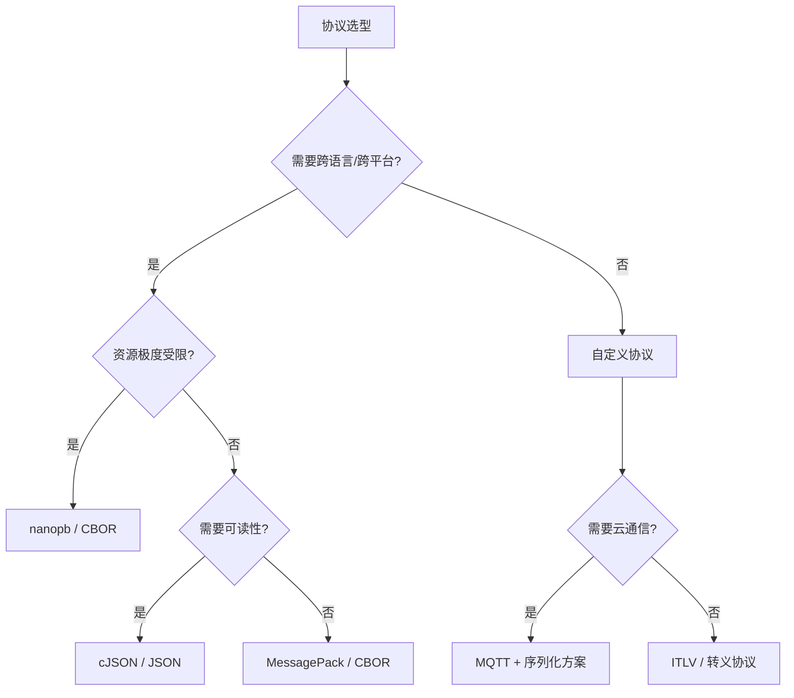

# MCU 自定义通信协议

> **文档说明**：本文档集整理了嵌入式 MCU 场景下自定义通信协议的设计方法与实践经验，涵盖多种协议方案和解析方式。

---

## 概述

在嵌入式通信开发中，协议解析是绑定硬件和软件的关键环节。**数据怎么来，就决定了怎么解析**。对于资源有限的单片机设备之间的通信，通常采用字节流的方式，因此需要解决以下核心问题：

| 问题 | 说明 |
|------|------|
| **粘包** | 多个数据帧粘连在一起，无法正确分割 |
| **断包** | 一帧数据分多次到达 |
| **丢包/错包** | 数据在传输中丢失或损坏 |
| **特殊字节冲突** | 数据域中包含与帧头帧尾相同的字节 |

---

## 方案对比

本文档集按**从基础概念到具体实现、从简单到复杂**的顺序组织：

| 顺序 | 方案 | 帧结构 | 校验方式 | 特色机制 | 适用场景 |
|------|------|--------|---------|---------|---------|
| 1 | [流式 vs 批量解析](./stream-vs-batch-parsing) | — | — | 两种解析方式的对比与选型 | 理解基础概念，选择解析策略 |
| 2 | [转义协议](./escape-protocol) | 帧头 + 长度 + 转义数据 + 校验 + 帧尾 | XOR 异或校验 | 转义编码解决特殊字节冲突 | 资源极受限的 8/32 位 MCU |
| 3 | [ITLV 协议](./itlv-protocol) | 帧头 + ID + Type + Length + Value + CRC16 | CRC16-X25 | 类型化数据、跨平台兼容 | 需要多种数据类型的板间通信 |

### 如何选择？

- **不确定用哪种解析方式** → 先看 [流式 vs 批量解析](./stream-vs-batch-parsing)
- **资源极受限、只需简单可靠传输** → [转义协议](./escape-protocol)
- **需要区分多种数据类型、跨平台通信** → [ITLV 协议](./itlv-protocol)

---

## 通用设计原则

无论采用哪种协议方案，以下设计原则都适用：

1. **字节序一致性**：跨平台通信必须明确字节序（通常采用小端序）
2. **固定宽度类型**：使用 `uint8_t`、`uint16_t` 等固定宽度类型，确保跨平台一致性
3. **静态内存分配**：嵌入式环境避免使用动态内存，防止内存碎片
4. **轻量级校验**：优先选择异或校验或 CRC16，避免过度消耗单片机有限的算力和内存资源
5. **完善的错误处理**：统一的错误码体系，便于问题定位

---

## 开源嵌入式协议方案对比

除了自定义协议外，嵌入式开发中还有许多成熟的开源协议方案可供选择。以下是常见方案的对比：

### 序列化/编码方案

| 方案 | 类型 | 编码体积 | 解析速度 | 内存占用 | 跨平台 | 适用场景 | 优点 | 缺点 |
|------|------|---------|---------|---------|--------|---------|------|------|
| **cJSON** | 文本 (JSON) | 大 | 慢 | 中 | ✅ 优秀 | 配置文件、调试接口 | 可读性好、调试方便、生态丰富 | 体积大、解析慢、内存碎片 |
| **CBOR** | 二进制 | 小 | 快 | 低 | ✅ 优秀 | IoT 通信、资源受限设备 | 体积小、解析快、JSON 兼容 | 调试不便、生态较小 |
| **MessagePack** | 二进制 | 中 | 快 | 中 | ✅ 优秀 | 跨语言通信 | 比 JSON 小、兼容性好 | 比 CBOR 大 |
| **nanopb** | 二进制 (Protobuf) | 极小 | 快 | 极低 | ✅ 优秀 | 嵌入式 Protobuf | 极小体积、强类型、跨语言 | 需要预编译、学习成本 |
| **FlatBuffers** | 二进制 | 小 | 极快 | 低 | ✅ 优秀 | 游戏、实时系统 | 零拷贝解析、极快 | 复杂度高、体积略大 |

### 通信协议框架

| 方案 | 层级 | 传输协议 | 资源需求 | 可靠性 | 适用场景 | 优点 | 缺点 |
|------|------|---------|---------|--------|---------|------|------|
| **MQTT** | 应用层 | TCP | 低 | 高 | IoT 云通信 | 轻量、QoS 支持、广泛支持 | 需要 Broker、依赖 TCP |
| **CoAP** | 应用层 | UDP | 极低 | 中 | 受限设备 | 比 HTTP 轻量、支持观察模式 | 可靠性需应用层保证 |
| **Modbus** | 应用层 | 串口/TCP | 极低 | 中 | 工控设备 | 简单、工业标准 | 功能有限、无安全机制 |
| **eRPC** | RPC 框架 | 多种 | 中 | 高 | 嵌入式 RPC | 跨核通信、自动序列化 | 较重、学习成本 |
| **LwIP** | 协议栈 | TCP/IP | 中 | 高 | 网络通信 | 完整 TCP/IP 栈、开源免费 | 内存占用较大 |

### 选型建议

### 快速选型表

| 场景 | 推荐方案 |
|------|---------|
| 简单片间通信、资源极受限 | 自定义转义协议 / ITLV |
| 需要多种数据类型、跨平台 | ITLV + CRC16 |
| 需要跨语言通信 | nanopb (Protobuf) |
| IoT 云平台通信 | MQTT + cJSON / CBOR |
| 配置文件存储 | cJSON |
| 工控设备通信 | Modbus |
| 跨核/多处理器通信 | eRPC |
