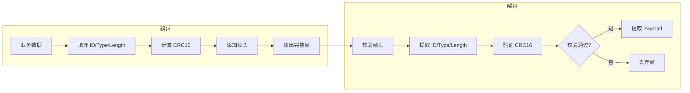
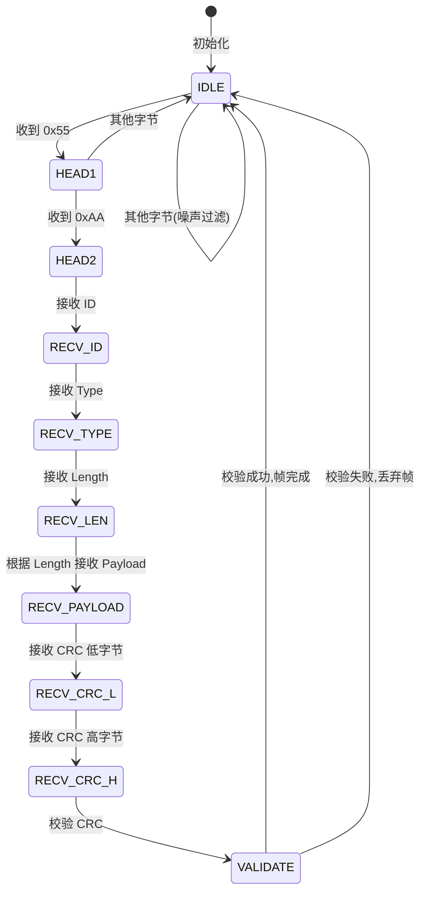

# ITLV 协议设计：类型化数据通信

> **文档说明**：本文档介绍一种基于 ITLV（ID-Type-Length-Value）结构的自定义通信协议，支持多种数据类型、跨平台兼容，适用于嵌入式板间通信场景。

---

## 目录

1. [协议设计原则](#1-协议设计原则)
2. [ITLV 字段定义](#2-itlv-字段定义)
3. [协议帧格式](#3-协议帧格式)
4. [数据结构设计](#4-数据结构设计)
5. [CRC16 校验](#5-crc16-校验)
6. [API 接口设计](#6-api-接口设计)
7. [使用示例](#7-使用示例)
8. [局限性与优化方向](#8-局限性与优化方向)
9. [总结](#9-总结)

---

## 1. 协议设计原则

- **字节序一致性**：跨平台通信必须明确字节序（本实现采用小端序）
- **固定宽度类型**：使用 `uint8_t`、`uint16_t` 等固定宽度类型，确保跨平台一致性
- **静态内存分配**：嵌入式环境避免使用动态内存，防止内存碎片
- **流式解析支持**：实际通信中数据是流式到达的，需要状态机处理粘包/断包
- **完善的错误处理**：统一的错误码体系，便于问题定位

### ITLV 是否需要额外的包头和校验？

只用 ITLV 四个字段够吗？这取决于应用场景：

| 场景 | 是否需要额外字段 | 原因 |
|------|---------------|------|
| **物联网端云通信**（基于 MQTT/TCP） | 仅 ITLV 即可 | TCP 本身提供校验和重传机制，平台 SDK 自动添加消息边界标识 |
| **嵌入式板间通信**（串口、CAN 等） | 需要增加包头 + CRC | 无 TCP 的可靠性保障，电磁干扰可能导致数据出错 |

根据实际需求还可扩展：分包传输需要包序号、多板通信需要目标地址等。

---

## 2. ITLV 字段定义

| 字段 | 含义 | 典型长度 | 说明 |
|------|------|---------|------|
| **I** (ID/Index) | 数据标识符 | 1~2 字节 | 区分不同类型的数据 |
| **T** (Type) | 数据类型 | 1 字节 | uint8、int32、string 等 |
| **L** (Length) | 数据长度 | 1~4 字节 | Value 字段的长度 |
| **V** (Value) | 实际数据 | N 字节 | 业务数据负载（Payload） |

其中，I、T、L 是固定长度字段。在制定协议前需要评估：

- 项目数据种类有多少 → **决定 I 的位宽**
- 单条数据最大长度是多少 → **决定 L 的位宽**

预留扩展空间可保证协议的通用性。一般 I 设置为 1~2 字节，T 设置为 1 字节，L 设置为 1~4 字节。

---

## 3. 协议帧格式

完整帧格式在 ITLV 基础上增加了包头和校验字段：

| 字段 | 长度 | 说明 |
|------|------|------|
| Head | 2 字节 | 固定为 `0x55`, `0xAA` |
| ID | 1 字节 | 协议标识符 |
| Type | 1 字节 | 数据类型 |
| Length | 1 字节 | Payload 长度（最大 255 字节） |
| Value/Payload | N 字节 | 实际数据 |
| CRC16 | 2 字节 | CRC16-X25 校验（小端序） |

**最小帧长度**：2（Head）+ 1（ID）+ 1（Type）+ 1（Length）+ 0（Value）+ 2（CRC）= **7 字节**

### 3.1 帧结构示意图

```
+------+------+------+--------+------------------+-----------+
| Head |  ID  | Type | Length | Value/Payload    | CRC16     |
+------+------+------+--------+------------------+-----------+
| 0x55 | 1B   | 1B   | 1B     | N 字节 (0~255)   | 2B 小端   |
| 0xAA |      |      |        |                  |           |
+------+------+------+--------+------------------+-----------+
|<-- 固定头部 (5B) -->|<-- 变长数据 --->|<-- 校验 (2B) -->|
```

### 3.2 组包与解包流程



---

## 4. 数据结构设计

### 4.1 跨平台打包属性

确保结构体按 1 字节对齐，消除填充字节：

```c
#if defined(__GNUC__) || defined(__clang__)
    #define PACKED_STRUCT __attribute__((packed))
#elif defined(_MSC_VER)
    #define PACKED_STRUCT
    #pragma pack(push, 1)
#else
    #define PACKED_STRUCT
    #warning "Unknown compiler, packed attribute may not work correctly"
#endif
```

### 4.2 类型定义

使用固定宽度 `uint8_t` 确保跨平台一致性，**避免使用 enum**（enum 的大小是编译器相关的）：

```c
typedef uint8_t tlv_type_t;

#define TLV_TYPE_UINT8      ((tlv_type_t)0x00)  // 无符号 8 位整数
#define TLV_TYPE_INT8       ((tlv_type_t)0x01)  // 有符号 8 位整数
#define TLV_TYPE_UINT16     ((tlv_type_t)0x02)  // 无符号 16 位整数
#define TLV_TYPE_INT16      ((tlv_type_t)0x03)  // 有符号 16 位整数
#define TLV_TYPE_UINT32     ((tlv_type_t)0x04)  // 无符号 32 位整数
#define TLV_TYPE_INT32      ((tlv_type_t)0x05)  // 有符号 32 位整数
#define TLV_TYPE_STRING     ((tlv_type_t)0x06)  // 字符串类型
#define TLV_TYPE_FLOAT      ((tlv_type_t)0x07)  // 浮点类型
#define TLV_TYPE_BYTES      ((tlv_type_t)0x08)  // 字节数组
```

### 4.3 协议数据结构

```c
typedef struct
{
    protocol_id_t id;                            // 协议 ID
    tlv_type_t    type;                          // 数据类型
    uint8_t       length;                        // 数据长度
    uint8_t       payload[PROTOCOL_VALUE_MAX_LEN]; // 负载数据
} protocol_data_t;
```

### 4.4 错误码定义

```c
typedef enum
{
    PROTO_OK               =  0,  // 操作成功
    PROTO_ERR_NULL_PTR     = -1,  // 空指针错误
    PROTO_ERR_BUF_TOO_SMALL= -2,  // 缓冲区太小
    PROTO_ERR_INVALID_HEAD = -3,  // 无效的包头
    PROTO_ERR_CRC_MISMATCH = -4,  // CRC 校验失败
    PROTO_ERR_INVALID_ID   = -5,  // 无效的协议 ID
    PROTO_ERR_PAYLOAD_SIZE = -6,  // 负载大小错误
    PROTO_ERR_IN_PROGRESS  = -7,  // 解析进行中
    PROTO_ERR_INVALID_LEN  = -8,  // 无效的数据长度
} protocol_err_e;
```

### 4.5 流式解析器定义

流式解析的核心是状态机。每收到一个字节，状态机根据当前状态决定下一步动作。**当遇到错误数据自动回到 IDLE 重新开始**，实现噪声过滤。

```c
typedef enum
{
    PARSE_STATE_IDLE = 0,        // 空闲状态
    PARSE_STATE_HEAD1,           // 等待包头第一字节
    PARSE_STATE_HEAD2,           // 等待包头第二字节
    PARSE_STATE_ID,              // 接收 ID
    PARSE_STATE_TYPE,            // 接收 Type
    PARSE_STATE_LENGTH,          // 接收 Length
    PARSE_STATE_PAYLOAD,         // 接收 Payload
    PARSE_STATE_CRC_LOW,         // 接收 CRC 低字节
    PARSE_STATE_CRC_HIGH,        // 接收 CRC 高字节
} parse_state_e;

typedef struct
{
    parse_state_e state;                    // 当前解析状态
    uint8_t      buffer[PROTOCOL_MAX_LEN];  // 接收缓冲区
    uint16_t     index;                     // 当前接收索引
    uint8_t      payload_len;               // 期望的负载长度
} protocol_parser_t;
```



---

## 5. CRC16 校验

CRC（循环冗余校验）用于检测数据传输错误。本协议采用 **CRC16-X25** 算法，使用查表法提高效率。

**校验范围**：从包头开始到 Payload 结束（不含 CRC 本身）。

---

## 6. API 接口设计

协议库提供 3 类 API：组包、一次性解包、流式解析。

### 6.1 组包

```c
/**
 * @brief  协议数据组包
 * @param  buf       输出缓冲区指针
 * @param  buf_size  缓冲区大小
 * @param  data      协议数据结构
 * @param  out_len   实际输出长度(输出)
 * @return PROTO_OK: 成功, 其他: 错误码
 */
protocol_err_e protocol_pack(uint8_t *buf,
                             size_t buf_size,
                             const protocol_data_t *data,
                             size_t *out_len);
```

### 6.2 一次性解包

```c
/**
 * @brief  一次性解包
 * @param  buf   输入缓冲区指针
 * @param  len   数据长度
 * @param  data  协议数据结构(输出)
 * @return PROTO_OK: 成功, 其他: 错误码
 */
protocol_err_e protocol_unpack(const uint8_t *buf,
                               size_t len,
                               protocol_data_t *data);
```

### 6.3 流式解析

```c
/**
 * @brief  初始化解析器
 */
protocol_err_e protocol_parser_init(protocol_parser_t *parser);

/**
 * @brief  重置解析器状态
 */
void protocol_parser_reset(protocol_parser_t *parser);

/**
 * @brief  流式解析 - 逐字节输入
 * @return PROTO_OK: 帧完成, PROTO_ERR_IN_PROGRESS: 解析中, 其他: 错误码
 */
protocol_err_e protocol_parse_byte(protocol_parser_t *parser, uint8_t byte);

/**
 * @brief  从解析器提取帧数据
 */
protocol_err_e protocol_parser_get_frame(const protocol_parser_t *parser,
                                         protocol_data_t *data);
```

---

## 7. 使用示例

### 7.1 业务数据定义

```c
// 业务协议 ID 定义
#define CMD_ID_LED_CTRL   (protocol_id_t)0x01
#define CMD_ID_DATE_TIME  (protocol_id_t)0x02

#pragma pack(push, 1)
typedef struct
{
    uint8_t led_id;     // LED 编号
    uint8_t on_off;     // 0=关闭, 1=打开
} led_ctrl_t;

typedef struct
{
    uint16_t year;
    uint8_t  month;
    uint8_t  day;
    uint8_t  hour;
    uint8_t  minute;
    uint8_t  second;
    uint8_t  reserved;
} datetime_t;
#pragma pack(pop)
```

### 7.2 一次性解析示例

```c
// 准备数据
led_ctrl_t led_cmd = { .led_id = 1, .on_off = 1 };
tx_data.id = CMD_ID_LED_CTRL;
tx_data.type = TLV_TYPE_BYTES;
tx_data.length = sizeof(led_cmd);
memcpy(tx_data.payload, &led_cmd, sizeof(led_cmd));

// 组包
protocol_pack(tx_buf, sizeof(tx_buf), &tx_data, &frame_len);

// 解包
ret = protocol_unpack(tx_buf, frame_len, &rx_data);
if (ret == PROTO_OK)
{
    led_ctrl_t *rx_led = (led_ctrl_t*)rx_data.payload;
    // 使用解析后的数据...
}
```

### 7.3 流式解析示例

```c
protocol_parser_t parser;
protocol_parser_init(&parser);

// 模拟逐字节接收
for (size_t i = 0; i < frame_len; i++)
{
    protocol_err_e ret = protocol_parse_byte(&parser, tx_buf[i]);

    if (ret == PROTO_OK)
    {
        // 帧接收完成
        protocol_parser_get_frame(&parser, &rx_data);
        // 使用解析后的数据...
        break;
    }
}
```

---

## 8. 局限性与优化方向

本 ITLV 协议是个最小实现，轻量简洁，适用于短距离、低误码率的嵌入式板间通信。

### 8.1 字段容量限制

| 字段 | 当前设计 | 局限性 | 优化方向 |
|------|---------|--------|---------|
| **ID** | 1 字节 (0~255) | 最多 256 种数据类型 | 扩展为 2 字节，支持 65536 种 |
| **Length** | 1 字节 (0~255) | 单帧最大 255 字节 | 扩展为 2 字节，或引入分包机制 |
| **Type** | 1 字节 | 当前仅做标记，未强制校验 | 可用于自动类型转换（大小端等） |

### 8.2 可靠性机制

当前协议的可靠性依赖 CRC 校验，可进一步优化：

- 增加 **ACK/NACK 确认机制**，实现丢包重传
- 增加 **帧序号**，支持分包传输和乱序检测
- 增加 **超时机制**，避免状态机卡死

### 8.3 状态机健壮性

当前状态机无超时机制，潜在问题：

- 接收到部分帧头后无后续数据 → 状态机停留在中间状态
- **优化方向**：增加超时检测，超时后自动复位到 IDLE 状态

---

## 9. 总结

| 特性 | 说明 |
|------|------|
| **简洁高效** | 最小帧 7 字节，开销合理 |
| **静态内存** | 无动态分配，适合嵌入式 |
| **流式解析** | 状态机自动处理粘包/断包 |
| **CRC 校验** | 保证数据完整性 |
| **跨平台** | 固定宽度类型、打包属性 |

**适用场景**：短距离、低误码率的嵌入式板间通信（串口、SPI、I2C 等）。

**不适用场景**：高可靠性要求、大数据传输、多设备组网、安全敏感的场合。

::: tip 延伸阅读
- 关于两种解析方式的详细对比，请参阅 [流式解析 vs 批量解析](./stream-vs-batch-parsing)
- 关于更轻量的转义编码方案，请参阅 [转义协议](./escape-protocol)
:::

---

## 参考来源

- [嵌入式大杂烩 - 简易嵌入式自定义协议设计思路](https://mp.weixin.qq.com/s/NQPatQBHTWRS18O2qPSVyA)
